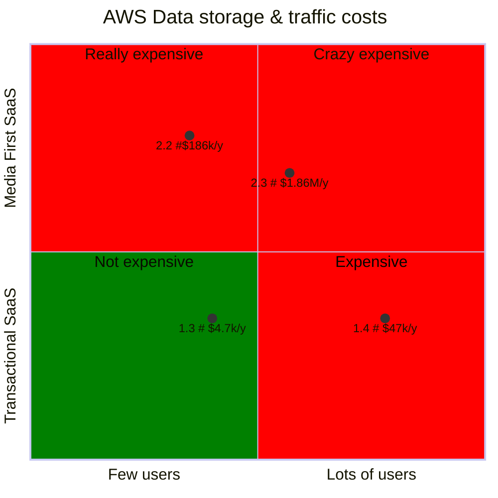

%{
  title: "Rightsizing your cloud data and traffic costs",
  thumbnail: "05-18-design-your-app-for-humans-software-and-agents.png",
  author: "Paul Sabou",
  tags: ~w(llm gen_ai better_apps),
  description: "When designing modern software products, it's crucial to recognize that different users—whether humans, external systems, or intelligent agents—interact with your product in fundamentally different ways."
}
---

Rightsizing data storage & traffic

For most apps out there we store & deliver a small amount of data. Typical scenarios are SaaS platforms where we store user data & some media and the user uses traffic associated with that during his web browsing.

### Transactional vs. Media First SaaS

What is a transactional SaaS? Accounting, Expense/Project management, etc. Media is not the primary value provided by the platform but it's a secondary value (supporting the primary benefit which is transactiona data). The users that work with the SaaS platform use it for managing transactions, processes and other things.

A media first SaaS is a platform that delivers lots of media to users. The media could be user generated (ie. photos, videos, audio) or sourced and sold by the platform to the users : music store, streaming store, etc. In this case the platform users see media storage & delivery as the primary goal of the platform.

### Realistic cost projections for AWS

### 1. Example transactional SaaS

#### 1.1. Transactional SaaS model
- user data (user media & saved data) - max 100 files (each file < 10 MB) => 1 GB / user stored
- TOTAL_USERS total users & MONTHLY_USERS = 20% * TOTAL_USERS (monthly active users)
- typical user session uses displays max 10% of their media assets (ie. user profile pic, org logo, etc.) => 100MB / session; typical user has max 5 sessions / month
- due to browser caching expiration policy data is cached for 1 month => monthly active user data usage < 500MB / month
- total site data traffic - MONTHLY_USERS X 500MB = THE_MONTHLY_SITE_TRAFFIC

#### 1.2 How much does this actually cost?

**1.3 Small transactional SaaS**
- TOTAL_USERS = 10k users 
- MONTHLY_USERS = 20% * TOTAL_USERS = 2k users
- THE_MONTHLY_SITE_TRAFFIC = 2 TB / month
- AWS S3 = 10 TB stored for 10k users costs costs 230 USD (at 23 USD / TB)
- AWS Cloudfront = 2 TB traffic (80 USD / TB)  => 160 USD / month (maybe less with the free tier)

Your AWS data related media costs you 390 USD x 12 = **4680 USD / year**

**1.4 Medium transactional SaaS**
- TOTAL_USERS = 100k users 
- MONTHLY_USERS = 20% * TOTAL_USERS = 20k users
- THE_MONTHLY_SITE_TRAFFIC = 20 TB / month
- AWS S3 = 100 TB stored for 100k users costs costs 23 00 USD (at 23 USD / TB)
- AWS Cloudfront = 20 TB traffic (80 USD / TB)  => 16 00 USD / month (maybe less with the free tier)

Your AWS data related media costs you 39 00 USD x 12 = **46 800 USD / year**

### 2. Example Media First SaaS

#### 2.1. Media First SaaS model
- user data (user media & saved data) - max 5000 files (each file  10 MB) => 50 GB / user stored
- TOTAL_USERS total users & MONTHLY_USERS = 20% * TOTAL_USERS (monthly active users)
- typical user session uses displays max 10% of their media assets => 5GB / session; typical user has max 5 sessions / month
- due to browser caching expiration policy data is cached for 1 month => monthly active user data usage < 25GB / month
- total site data traffic - MONTHLY_USERS X 25GB = THE_MONTHLY_SITE_TRAFFIC

**2.2 Small Media First SaaS**
- TOTAL_USERS = 10k users 
- MONTHLY_USERS = 20% * TOTAL_USERS = 2k users
- THE_MONTHLY_SITE_TRAFFIC = 50 TB / month
- AWS S3 = 500 TB stored for 10k users costs costs 11 500 USD (at 23 USD / TB)
- AWS Cloudfront = 50 TB traffic (80 USD / TB)  => 4 000 USD / month (maybe less with the free tier)

Your AWS data related media costs you 15 500 USD x 12 = **186 000 USD / year**

**2.3 Medium Media First SaaS - 1.86M USD / yr**
- TOTAL_USERS = 100k users 
- MONTHLY_USERS = 20% * TOTAL_USERS = 20k users
- THE_MONTHLY_SITE_TRAFFIC = 500 TB / month
- AWS S3 = 5 000 TB stored for 100k users costs costs 115 000 USD (at 23 USD / TB)
- AWS Cloudfront = 500 TB traffic (80 USD / TB)  => 40 000 USD / month (maybe less with the free tier)

Your AWS data related media costs you 155 000 USD x 12 = **1860 000 USD / year**

**Congratulations - Your AWS Bill is almost 2M USD. The AWS Cloud team will send you a 100 USD chocolate box for your birthday. Every year!**

https://world.hey.com/dhh/it-s-five-grand-a-day-to-miss-our-s3-exit-b8293563
## References
* [AWS S3 pricing](https://aws.amazon.com/s3/pricing/)
* [AWS Cloudfront pricing](https://aws.amazon.com/cloudfront/pricing/)