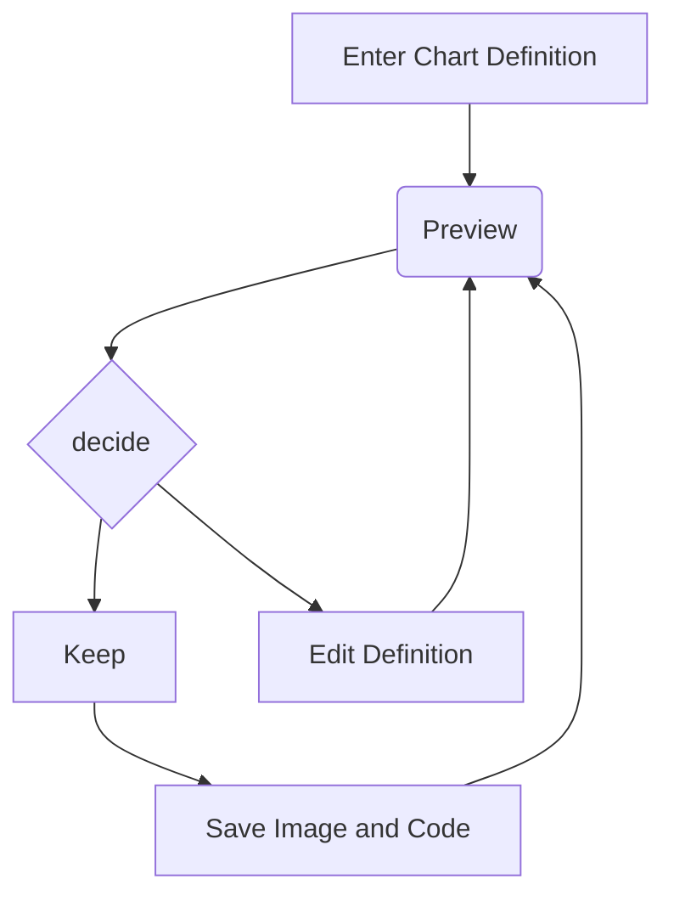

%{
  title: "BAML is an LLM query language",
  thumbnail: "01-22-baml-preview.png",
  author: "Paul Sabou",
  tags: ~w(llm gen_ai),
  description: "BAML - a specialized, typed, composable integration layer that brings reliability, clarity, and repeatability to every prompt and response"
}
---

# Overview

Modern applications never run in isolation—they constantly integrate with external systems such as SQL databases (e.g. PostgreSQL), third-party HTTP/GraphQL APIs, client browsers, and, since 2020, large-language models (LLMs). Each of these systems exposes its own “idiomatic language” and tooling: the concepts you use, the API surface, the guarantees provided, and the developer experience (DX) around testing, security, and cost control.

It makes sense to expect that LLMs deserve the same rigor: a specialized, typed, composable integration layer that brings reliability, clarity, and repeatability to every prompt and response.

## Examples of “Idiomatic Languages”

### SQL Databases: Declarative, Typed, Reliable

- **Concepts & protocol**  
  Tables, columns, rows, schemas, constraints.  
  Queries (e.g. `SELECT`, `INSERT`, `UPDATE`) are declarative: you state *what* you want, not *how* to get it.  
- **Type safety & consistency**  
  Columns have rigid types (e.g. `TIMESTAMP WITH TIME ZONE`). The wire protocol guarantees that if you send a timestamp today, you’ll get back the *same* timestamp tomorrow.

### Client Browsers: HTML & CSS

- **Markup & styling**  
  HTML describes structure; CSS describes presentation.  
- **Deterministic rendering**  
  Despite small quirks across engines (Chrome, Safari, mobile-webviews), the browser faithfully renders the tree you send.

### External APIs: OpenAPI & GraphQL

- **Formal interface definitions**  
  REST APIs use OpenAPI specs; GraphQL services publish a schema.  
- **Auto-generated clients**  
  From these specs you can generate type-safe client stubs, validators, mocks, etc., ensuring that your app “knows” exactly what to send and receive.

---

## Where Do LLMs Fit In?

Like any external system, an LLM has:

1. **A request language** (prompts + tool-invocation syntax)  
2. **A response format** (text, JSON, XML, etc.)  
3. **A runtime spectrum** (instruction-fine-tuned vs. chain-of-thought vs. retrieval-augmented; small vs. large models; cost/latency trade-offs)

But if you treat prompts as “just text,” you lose all the benefits above: composability, type checking, reliable parsing, streaming, mocking, testing, and so on.

## Why Pure Natural Language Falls Short

Natural language prompts are great for *instructions*, but fail to guarantee *structured* outputs:

- **Tool use**  
  You want the model to return exactly:  
  ```json
  { "function": "getUserById", "args": { "userId": 42 } }
  ```
Free-form text can drift, break JSON validity, or omit required fields.

Typed data
Dates, numbers, arrays of objects, nested records—natural language makes every response a mini-NLP problem.

## Requirements for an LLM “SQL”
To achieve SQL-level reliability with LLMs, we need a prompt–response language that is:

### 1. Composable
Reuse fragments, macros, and schemas to build larger prompts without copy-paste drift.

### 2. Type-safe
Declare output schemas with primitives (boolean, number, date, string, array, object) and validate at generation time.

### 3. Robust parser
Handle extra whitespace, minor deviations, or partial outputs gracefully—especially on smaller or less consistent models.

### 4. Streaming support
Emit partial data as soon as it’s ready (e.g. for token-by-token UI updates or long lists).

## Introducing BAML
[BAML (Basically a Made-up Language)](https://github.com/BoundaryML/baml) is a small, declarative language that lives on top of natural language to give you all of the above:

 Define a schema for a user lookup
```
schema GetUserResponse {
  userId: integer
  name: string
  email: string
  createdAt: datetime
}
```

prompt 
```
Please call the function `getUserById` with the following parameter:
- userId: 42

Return the output matching schema `GetUserResponse`.
```

Declarative schemas
You can be explicit about every field, its type, and any nested structures.

Smart parsers
BAML ships with resilient parsing logic that tolerates common formatting slips.

Streaming & partial
If you ask for a list of 1,000 items, BAML can emit them as a JSON-lines stream.


`youtube: https://www.youtube.com/watch?v=S9jxdVLFDJU`


## Conclusion
LLMs may feel magical, but magic without guardrails is brittle. By treating LLMs as just another external system—complete with a robust integration language, type system, and tooling—you reap the same DX and reliability you expect from SQL, browsers, and OpenAPI-driven services.

BAML is one step toward that vision: a concise, composable, typesafe wrapper around natural language that brings predictability to every token.

Ready to give your prompts SQL-level guarantees? Explore BAML and see how structured LLM integration can transform your development workflow.

# Super Diagram




## References
- [BAML repo](https://github.com/BoundaryML/baml)
- [What is BAML?](https://docs.boundaryml.com/guide/introduction/what-is-baml)